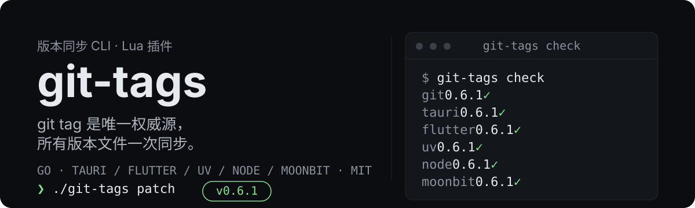
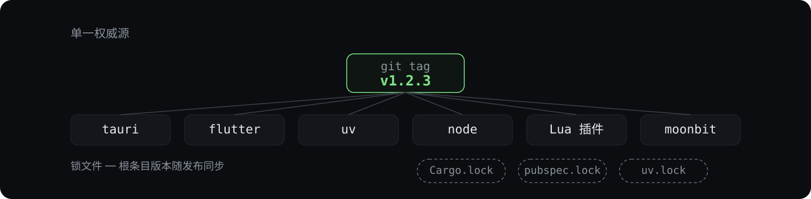

<p align="center">
  
</p>

# git-tags

**一条命令让项目版本与 git tag 永远保持一致。** git tag 是唯一权威源：`git-tags` 把同一个版本写入项目的所有版本文件，然后创建 tag——发布新版本再也不用手动改五个文件。

- **零安装开箱即用** —— 内置 tauri、flutter、uv python、node 支持（Lua 插件已内嵌进二进制，无需任何安装）
- **Lua 可扩展** —— 一个 `.lua` 文件即可支持任意项目结构，无需改 Go 代码
- **锁文件只读** —— `Cargo.lock`、`pubspec.lock`、`uv.lock` 只做一致性校验、绝不写入（由你的工具链重新生成）

## 快速开始

```bash
go build -o git-tags main.go        # 或直接下载 release 二进制
./git-tags check                    # 检查 tag 与所有版本文件是否一致
./git-tags patch                    # 递增 patch、同步全部文件、创建 tag
```

> 提示：如果 PATH 里的 `git-tags` 还是旧版本（`-h` 里看不到 `check` / `sync` / `set` / `plugins`），用新构建替换——`go build -o git-tags.exe .` 后把 `git-tags.exe` 复制到 PATH 中的目录，或直接使用本地二进制。

`check` 会为每个激活的 provider 打印一行：

```text
git        0.6.1        ✓
tauri      0.6.1        ✓
node       0.6.1        ✓
```

出现任何 `✗` 都说明某个文件与 tag 不一致——先运行 `sync` 对齐，再 bump。

## 工作原理

一个源头，多处输出：

<p align="center">
  
</p>

1. `git-tags patch` 读取**最新 git tag** 作为权威版本。
2. 每个激活的 provider 把该版本写入自己的文件（`package.json`、`src-tauri/tauri.conf.json`、`Cargo.toml`、`pubspec.yaml`、`pyproject.toml` …）。
3. 创建新 tag——可顺带提交（`--commit`）与推送（`--push`）。

## 命令

`git-tags -h` 按两组展示：**Git 管理**（`ls` / `patch` / `minor` / `major` / `push` / `del`）与**插件与版本管理**（`check` / `sync` / `set` / `plugins`）。

| 命令 | 作用 |
|------|------|
| `ls` | 列出所有 tag |
| `patch` / `minor` / `major` | 递增版本、同步所有文件、创建 tag |
| `check` | 校验每个 provider 是否与 tag 一致 |
| `sync` | 把 tag 版本写回所有可写文件 |
| `set 1.4.0` | 直接指定版本（可选创建 tag） |
| `push` | 推送最新 tag 到远端 |
| `del` | 删除最新 tag，并默认把版本文件**回滚**到新的最新 tag（无更早 tag 时只删 tag、不动文件） |
| `plugins list` / `validate` | 列出与校验 Lua 插件 |

常用参数：`--dry-run` 预览每个文件的改动（`旧值 → 新值`）；`--commit` 把版本文件随 tag 一起提交；`--no-tag` 只改文件不建 tag；`-p, --push` 打 tag 后推送远端。

`set` 定向用法：`git-tags set 1.4.0 --framework flutter` 只把 flutter 的版本文件改成 1.4.0（**不创建 tag**），适合只想动其中一个框架的场景；定向改动由之后的全量 `set` / `patch` 统一收口到 git tag。

## 配置

项目根目录下可选的 `.git-tags.toml`：

```toml
[core]
tag_prefix = "v"
enabled = ["git", "tauri"]     # 只启用这些 provider（默认全部）

[provider.uv]
writable = false               # 只校验、绝不写入
```

## Lua 插件

一个 `.lua` 文件就是一个 provider 或 hook。放进 `<repo>/.git-tags/plugins/` 或全局插件目录即自动加载；同名插件会覆盖内置实现。

```lua
plugin = {
  name = "myapp",
  type = "provider",
  priority = 50,
}

function plugin.detect(project)
  local ok, _ = pcall(gt.read_file, "VERSION")
  return ok
end

function plugin.read(project)
  return gt.read_file("VERSION"):match("^%s*([^%s\n]+)")
end

function plugin.write(project, version)
  gt.write_file("VERSION", version .. "\n")
end
```

Hook 围绕 bump 流程执行（`pre_bump` → 写文件 → `post_bump` → 建 tag → `post_tag`）。沙箱化的 `gt` API——文件访问仅限项目内、semver 辅助函数、git tag 查询——保证脚本安全：5 秒超时、禁用 `os`/`io`/`package`、panic 不会导致工具崩溃。

## 注意事项

- 锁文件**只校验、绝不写入**。bump 之后运行你的工具链（`cargo build`、`flutter pub get`、`uv sync`）重新生成，再 `check` 一次。
- Flutter 的 `X.Y.Z+build`：写入时保留 build 号，比较时使用基础版本。

## 友情链接

- [LINUX DO](https://linux.do)

## License

[MIT](LICENSE)
